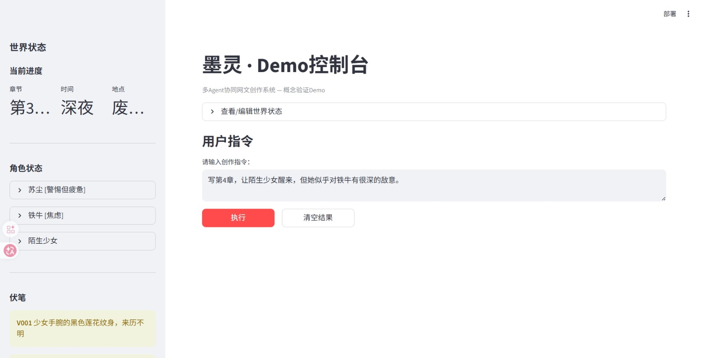

# 墨灵（MoeWrit）使用说明

## 一、项目简介

墨灵是一套多 Agent 协同网文创作系统的**概念验证 Demo**。系统由 4 个 AI Agent 角色协同工作，完成从"一句话指令"到"完整章节"的创作流水线。

### 四个 Agent 角色

| Agent | 职责 |
|-------|------|
| 主编剧 | 接收用户指令和世界状态，生成结构化章节剧本（JSON） |
| 创作班组 | 根据剧本写出小说正文（800-1500 字） |
| 质检员 | 审查初稿的逻辑矛盾，提供伏笔利用建议 |
| 世界知识库 | 管理世界状态文件，记录角色、伏笔、时间线变更 |

### 创作流水线（6 步闭环）

```
用户指令 → 查询世界状态 → 生成剧本 → 撰写初稿 → 质检审查 → 修正终稿 → 更新世界状态
```

---

## 二、环境准备

### 2.1 系统要求

- Python 3.10+
- 可访问 OpenAI 兼容 API（支持 GPT-4o、DeepSeek 等）

### 2.2 安装步骤

```bash
# 1. 进入项目目录
cd MoeWrit

# 2. 创建虚拟环境（推荐）
python -m venv .venv

# 3. 激活虚拟环境
# Windows:
.venv\Scripts\activate
# Mac / Linux:
source .venv/bin/activate

# 4. 安装依赖
pip install -r requirements.txt
```

### 2.3 配置 API Key

```bash
# 复制配置模板
cp .env.example .env
```

然后编辑 `.env` 文件，填入真实配置：

```ini
# OpenAI 官方 API
OPENAI_API_KEY=sk-your-api-key-here
OPENAI_BASE_URL=https://api.openai.com/v1
MODEL_NAME=gpt-4o

# 或者使用 DeepSeek API
# OPENAI_API_KEY=sk-your-deepseek-key
# OPENAI_BASE_URL=https://api.deepseek.com/v1
# MODEL_NAME=deepseek-chat
```

- **`OPENAI_API_KEY`**：你的 API 密钥（必填）
- **`OPENAI_BASE_URL`**：API 地址，使用中转服务时修改此值
- **`MODEL_NAME`**：模型名称，推荐使用支持 JSON Mode 的模型

---

## 三、启动应用

```bash
streamlit run app.py
```

启动后浏览器会自动打开 `http://localhost:8501`。

**手动打开：** 如果浏览器未自动打开，在浏览器地址栏输入 `http://localhost:8501`。

**指定端口：**
```bash
streamlit run app.py --server.port 8080
```

---

## 四、界面布局与操作

### 4.1 主界面



### 4.2 操作步骤

1. **查看世界状态**：左侧边栏展示当前故事的时间线、角色状态、伏笔列表
2. **输入创作指令**：在主区域文本框中输入一句话指令（已预填示例）
3. **点击"执行"**：系统自动运行 5 步创作流水线，逐步展示每步结果
4. **查看结果**：流水线完成后，页面依次展示：
   - **主编剧剧本**（JSON，点击展开/折叠）
   - **初稿正文**（小说正文全文）
   - **质检报告**（黄色警告框显示矛盾 + 蓝色信息框显示伏笔建议）
   - **修正终稿**（根据质检意见修正后的正文）
   - **世界状态更新日志**（本章产生的状态变更记录）
5. **清空结果**：点击"清空结果"按钮清除当前结果，可重新输入指令执行

---

## 五、Demo 演示故事

系统预置了一个废土东方玄幻故事《星火纪元》的世界状态：

- **主角**：苏尘，23 岁猎人，左臂受伤未愈
- **队友**：铁牛，憨厚可靠的伙伴
- **当前进度**：第 3 章刚结束，在废墟中救了一个昏迷的陌生少女
- **预置伏笔**：少女手腕的黑色莲花纹身、苏尘左臂伤势

**预设演示指令：**
> 写第 4 章，让陌生少女醒来，但她似乎对铁牛有很深的敌意。

---

## 六、修改世界状态

你可以直接编辑 `world_state.md` 文件来改变故事的初始状态：

- **新增角色**：在"角色状态"区域按格式添加
- **埋设伏笔**：在"未回收伏笔"区域添加新条目
- **修改进度**：更改章节数、时间、地点

编辑后刷新页面（F5），侧边栏会自动展示最新状态。

---

## 七、项目文件结构

```
MoeWrit/
├── app.py              # Streamlit 主应用
├── world_state.md      # 世界状态文件（可直接编辑）
├── requirements.txt    # Python 依赖
├── .env.example        # API 配置模板
├── .env                # 实际 API 配置（不提交版本控制）
└── screenshot.png      # 主界面截图
```

---

## 八、常见问题

**Q: 启动报错 "No module named 'streamlit'"**
```bash
pip install -r requirements.txt
```

**Q: 执行按钮没有反应**
确保 `.env` 文件中的 `OPENAI_API_KEY` 已配置。Phase 1 使用占位数据，无需 API Key 即可演示。

**Q: 如何切换模型？**
编辑 `.env` 中的 `MODEL_NAME`，改为 `gpt-4o`、`deepseek-chat` 或其他支持 OpenAI 兼容接口的模型名称。

**Q: 每次创作都会更新 world_state.md 吗？**
是的。每次流水线执行完毕后，系统会提取本章的状态变更并追加写入 `world_state.md`。
